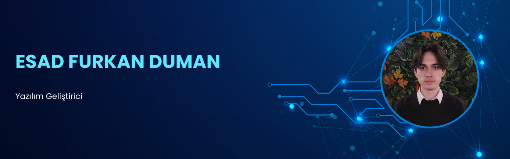

  
  <h1>Selam, ben Esad Furkan!</h1>
  

    <em>Yazılım ve robotiğe adanmış bir ruhla, kod satırlarından geleceği inşa eden bir geliştiriciyim. 
    <strong>42 İstanbul</strong>'da sınırları zorluyor, <strong>Pulsar Tech</strong> ile insanlık için teknoloji üretiyorum.</em>
  

  

    &nbsp;
    &nbsp;
    
  

---

## Hakkımda

Ben Esad Furkan, teknolojiye ve problem çözmeye küçüklüğümden beri tutkuyla bağlıyım. Sürekli öğrenme ve yenilikçi çözümler üretme arayışım, beni yazılım ve robotik dünyasının derinliklerine yönlendirdi.

* **42 İstanbul** öğrencisiyim; burada sadece kod yazmayı değil, aynı zamanda öğrenmeyi öğreniyor ve bir takımın parçası olarak karmaşık projeler geliştiriyorum.
* Ana odak alanlarım **Yapay Zeka** (görüntü, ses, metin işleme), **Robotik Sistemler** ve **Yazılım Geliştirme**.
* Temel amacım, insanlığa fayda sağlayan, etki yaratan teknolojiler geliştirmek.
* **İngilizce (C2 Seviye)** bilgimle global kaynakları etkin bir şekilde takip ediyor ve uluslararası projelerde yer almayı hedefliyorum.

---

## Yetenekler ve Teknolojiler

Aşağıda sıkça kullandığım ve uzmanlaştığım teknolojileri ve araçları bulabilirsiniz:

| Kategori                          | Teknolojiler                                                                                                                                                                                                                                                                                         |
| :-------------------------------- | :--------------------------------------------------------------------------------------------------------------------------------------------------------------------------------------------------------------------------------------------------------------------------------------------------- |
| **Programlama Dilleri** |      |
| **Web & Frameworks** |   `Next.js` `Tailwind CSS` `Django`                                                                                                                                                                                                |
| **Tasarım, Donanım & Araçlar** |     `RAG`                                  |

---

## Projeler ve Başarılar

  
<strong>Pulsar Tech & TEKNOFEST Başarıları</strong>

   
  <strong>Pulsar Tech</strong> takım kaptanı olarak, insanlık yararına teknolojiler geliştiriyor ve ulusal arenada önemli başarılara imza atıyoruz. Ekip çalışmasına ve yenilikçi çözümlere olan inancımızla öne çıkan başarılarımız:
  <ul>
    <li><strong>TEKNOFEST 2024 Adana</strong> - Robotaksi (Binek Otonom Araç) Yarışması - <strong>Finalist</strong></li>
    <li><strong>TEKNOFEST 2024</strong> - Makeathon Yarışması - <strong>Türkiye 4.'lüğü</strong></li>
    <li><strong>TEKNOFEST 2023 Ankara</strong> - Robotaksi (Binek Otonom Araç) Yarışması - <strong>Türkiye 7.'liği</strong></li>
  </ul>
  

    <a href="https://www.linkedin.com/company/pulsar-tech-team/">Pulsar Tech'i LinkedIn'de Keşfet</a>
  

  
<strong>Proje: Tercih Noktam</strong>

   
  Üniversite adayı öğrencilerin bilinçli kararlar vermelerine yardımcı olmak amacıyla geliştirilen <strong>"Tercih Noktam"</strong>, yapay zeka destekli rehberlik ve akran dayanışmasını bir araya getiren yenilikçi bir web platformudur.
   
  <em>Kullanılan Teknolojiler: Next.js, Tailwind CSS, Django, RAG (Retrieval Augmented Generation)</em>
   
  

    <a href="https://tercihnoktam.com">Tercih Noktam'a Göz At</a>
  

  
<strong>Proje: Çok Dilli Çıktı Uygulaması</strong>

   
  Farklı dilleri etkin bir şekilde analiz ederek kullanıcıya anlamlı ve doğru çıktılar sunan bu uygulama, özellikle yapay zeka ve metin işleme alanlarındaki yetkinliklerimi sergilediğim bir projedir.
   
  <em>Kullanılan Teknolojiler: Python</em>

---

## GitHub İstatistikleri

  
   
  

---

## Deneyim ve Eğitim

### Deneyimler
* **Web Developer** | Bionluk (Serbest Çalışan) | <em>Eylül 2024 - Devam Ediyor</em>
* **Software Developer & Takım Kaptanı** | Pulsar Tech | <em>Mart 2022 - Devam Ediyor</em>
    * <em>TEKNOFEST'te otonom araç ve makeathon yarışmalarında önemli dereceler.</em>
* **Competitor** | TEKNOFEST | <em>Ağustos 2023 - Devam Ediyor</em>
    * <em>2023 Robolig (7.'lik), 2024 Robolig (7.'lik), 2024 Makeathon (4.'lük)</em>
* **Intern** | Türkiye Teknoloji Takımı Vakfı | <em>Temmuz 2023 - Ağustos 2023</em>
* **Information System Intern** | Teksan™ | <em>Temmuz 2022 - Temmuz 2022</em>

### Eğitim
* **42 İstanbul** | Yazılım Mühendisliği | <em>Devam Ediyor (Beklenen Mezuniyet: Nisan 2025)</em>
* **Şehit Salih Alışkan Mesleki ve Teknik Anadolu Lisesi** | Bilişim Teknolojileri (4.0/4.0) | <em>Eylül 2020 - Haziran 2024</em>
* **Amerikan Kültür Dil Okulları** | İngilizce (C2 Seviye) | <em>Mart 2023 - Mayıs 2024</em>
* **Deneyap Türkiye Atölyeleri** | İleri Seviye Teknoloji Eğitimleri | <em>Mayıs 2022 - Mayıs 2024</em>
    * <em>Tasarım Üretim, Elektronik Programlama ve IoT, Yazılım Teknolojileri, Siber Güvenlik, Yapay Zeka, İleri Robotik ve daha fazlası...</em>

---

## Sertifikalar ve Lisanslar

* **Teknofest Adana Robolig Finalist Belgesi** (TEKNOFEST, Ağustos 2024)
* **Teknofest Ankara Robolig Finalist Belgesi** (TEKNOFEST, Eylül 2023)
* **C2 Seviye İngilizce Sertifikası** (Amerikan Kültür Dil Okulları, Şubat 2023)
* **IHA-1 - Sportif/Amatör Pilot Lisansı** (SHGM, Aralık 2023)
* **Arduino Eğitimi Katılım Belgesi** (İstanbul İşletme Enstitüsü, Ağustos 2021)

*(Daha fazlası için <a href="https://www.linkedin.com/in/esad-furkan-duman/">LinkedIn profilime</a> göz atabilirsiniz.)*

---

## İletişim

  Projeler hakkında sohbet etmek, potansiyel iş birlikleri veya farklı konular için  aşağıdaki kanallardan bana ulaşabilirsiniz.

  &nbsp;
  &nbsp;
  

---

  

  
<em>GitHub profilime zaman ayırdığınız için teşekkürler.</em>

